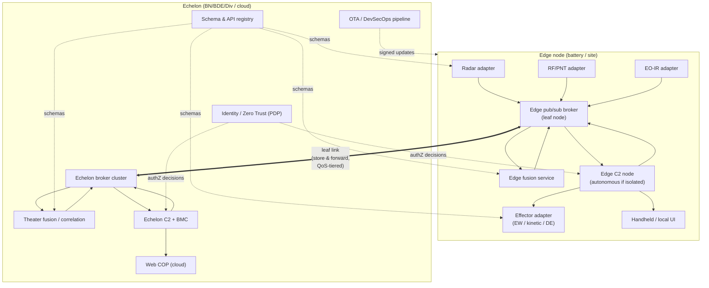
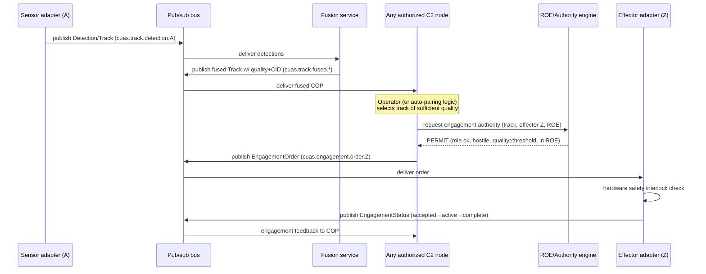
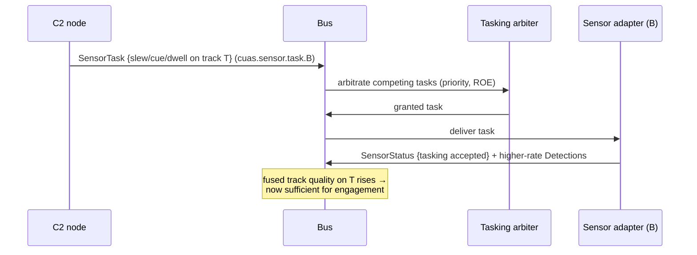

# 01 — Reference Architecture

This is the engineering reference. It defines the layers, the components, the
interfaces between them, and how each of the five imperatives maps onto concrete
parts you can build, buy, and recompete.

## 1. Design tenets

These constrain every downstream choice.

1. **Government owns the interfaces.** Components are replaceable; the contracts
   between them are not vendor property. (Imperative 2.)
2. **Bus first, point-to-point never.** Components integrate to the bus and the
   published schemas, not to each other. (Imperative 3.)
3. **Any-sensor / any-shooter.** Track production, fusion, and engagement are
   decoupled so any authorized node can pair any track with any effector.
   (Imperatives 4, 5.)
4. **Degrade, don't fail.** Every node must keep fighting through Denied,
   Degraded, Intermittent, and Limited-bandwidth (DDIL) conditions. Edge autonomy
   is the default; echelon adds reach, not dependency.
5. **Positive control is non-negotiable.** Distribution of fire control expands
   *who can* engage; it never weakens *whether they're allowed to*. (Imperative 5,
   bounded by [§05](05-security-authority-safety.md).)
6. **Cloud-native, OTA-updatable.** The C2 baseline, sensors, and effectors update
   over the air under continuous ATO. (Imperative 1, [§06](06-edge-topology-devsecops-ota.md).)

## 2. Logical layers

```
┌──────────────────────────────────────────────────────────────────────────┐
│  L5  PRESENTATION        Common C2 UI (web/cloud), role-tailored views,    │
│                          mobile/handheld, OTA-delivered           (Imp 1)  │
├──────────────────────────────────────────────────────────────────────────┤
│  L4  C2 / BATTLE MGMT    COP, track mgmt, sensor tasking, weapon-target    │
│                          pairing, engagement orders, ROE engine   (Imp 1,4,5)│
├──────────────────────────────────────────────────────────────────────────┤
│  L3  FUSION & SERVICES   Track fusion/correlation, identity (CID),         │
│                          airspace/deconfliction, analytics        (Imp 3)  │
├──────────────────────────────────────────────────────────────────────────┤
│  L2  DATA BACKBONE       Pub/sub bus (edge + echelon), schema registry,    │
│                          QoS, store-and-forward                   (Imp 3)  │
├──────────────────────────────────────────────────────────────────────────┤
│  L1  INTEGRATION / API   Government-owned APIs + adapters that map vendor   │
│                          sensors/effectors to canonical schemas   (Imp 2)  │
├──────────────────────────────────────────────────────────────────────────┤
│  L0  EDGE MATERIEL       Sensors (radar/RF/EO-IR/acoustic), effectors      │
│                          (kinetic/EW/directed), gateways                    │
├──────────────────────────────────────────────────────────────────────────┤
│  XX  CROSS-CUTTING       Identity/Zero Trust, Security/PKI, Time sync,     │
│                          Observability, OTA/DevSecOps, Safety interlocks    │
└──────────────────────────────────────────────────────────────────────────┘
```

The contract between **L1 and L2** is the heart of the whole design: vendor
materiel is mapped, once, through a government-owned adapter into the canonical
data model, after which it is interchangeable on the bus.

## 3. Component view



### Component responsibilities

| Component | Responsibility | Imperatives |
|---|---|---|
| **Sensor adapter** | Map a vendor sensor's native output to the canonical `Track`/`Detection` schema; accept `SensorTask`. The government owns the *interface*; the vendor owns the *driver*. | 2, 4 |
| **Effector adapter** | Map a vendor effector to canonical `EffectorStatus`; accept `EngagementOrder`; report `EngagementStatus`; enforce hardware safety interlocks. | 2, 5 |
| **Pub/sub broker** | Transport tracks, tasks, orders, status with QoS tiers; leaf/edge brokers federate to echelon; store-and-forward across DDIL links. | 3 |
| **Fusion service** | Correlate detections into single system tracks; assign track quality and combat identity (CID); deduplicate across sensors. | 3 |
| **C2 node** | Maintain the COP; arbitrate sensor tasking; perform weapon-target pairing; issue engagement orders subject to the ROE engine and authority checks. | 1, 4, 5 |
| **ROE / authority engine (PDP)** | Decide, per request, whether a node/operator may task a sensor or order an engagement, given role, ROE state, airspace, and track quality. | 5 |
| **Common UI** | Role-tailored, web-based COP and engagement controls; handheld variant for the edge; delivered/updated OTA. | 1 |
| **Schema & API registry** | Single source of truth for interface versions and conformance artifacts. | 2 |
| **OTA / DevSecOps** | Build, sign, and push updates to C2, sensors, and effectors under continuous ATO. | 1, 6 |

## 4. The any-sensor / any-shooter flow

This sequence is the architecture's reason for existing. Note the decoupling:
the sensor that detects, the node that decides, and the effector that engages need
no prior pairing.



Key properties this buys:
- **No dedicated pairing.** Sensor A never had to know about effector Z.
- **Graceful loss.** If C2 node 1 is destroyed, node 2 — already subscribed to the
  same fused COP — can pick up the engagement.
- **Track-quality gating.** Engagement is gated on fused track quality, not on
  which sensor produced it. Remote sensor tasking (imperative 4) exists to *raise*
  that quality on demand (cue another sensor onto the track).

## 5. How remote sensor tasking improves the picture



Tasking is itself a bus message governed by the same authority engine, so
"control sensors and effectors as needed across the network" (imperative 4) is a
first-class, audited operation, not a side channel.

## 6. Deployment views (summary)

Two reference footprints; full detail in [§06](06-edge-topology-devsecops-ota.md).

- **Edge / disconnected:** broker leaf node + fusion + C2 + UI run on a single
  rugged compute node at the site. Fully mission-capable with zero reachback.
  Federates opportunistically to echelon when a link exists.
- **Echelon / cloud:** broker cluster + theater fusion + BMC + web COP + registry
  + OTA pipeline + identity PDP run in an accredited cloud/enclave (e.g., a DoD
  DevSecOps platform). Provides cross-site fusion, wide-area COP, and the update
  pipeline.

The *same canonical schemas and the same APIs* run at both tiers. Echelon is a
superset of capability, never a dependency for edge survival.

## 7. Interface contracts (where the specs live)

| Interface | Direction | Contract artifact |
|---|---|---|
| Sensor → bus (tracks) | publish | `specs/schemas/track.schema.json`, `specs/asyncapi/cuas-pubsub.yaml` |
| C2 → sensor (tasking) | publish | `specs/schemas/sensor-task.schema.json` |
| C2 → effector (engagement) | publish | `specs/schemas/engagement-order.schema.json` |
| Effector → bus (status) | publish | `specs/schemas/engagement-status.schema.json`, `effector.schema.json` |
| Operator/integrator → C2 | request/response | `specs/openapi/cuas-c2.yaml` |
| All messages | envelope | `specs/schemas/envelope.schema.json` |

These artifacts are the deliverable of imperative 2 and the conformance target for
every vendor. See [§02](02-api-governance.md) for how they are governed.

## 8. What this architecture deliberately does *not* fix

- It does not specify a particular radar, effector, or AI classifier — those are
  competed *behind* the interfaces.
- It does not replace service-specific fire-control safety certification; it
  provides the digital authority/interlock framework those certifications attach
  to ([§05](05-security-authority-safety.md)).
- It does not assume a single cloud or transport; the bus and schemas are portable
  across DDIL transports and accredited environments.

Continue to [§02 — API Governance](02-api-governance.md).
