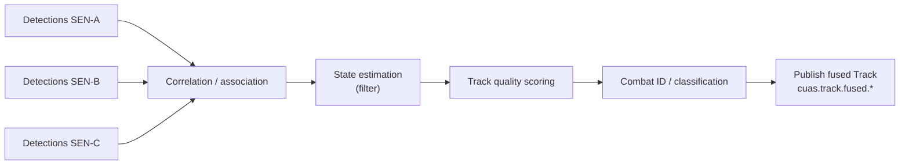

# 03 — Pub/Sub Backbone & Canonical Data Model

> Imperative 3: *Ensure a pub/sub engine at the edge and at echelon to stitch
> together diverse sensors and effectors, enabling real-time data sharing and
> track fusion across all sensors.*

The bus is what makes "any-sensor / any-shooter" mechanically possible. Producers
and consumers never address each other; they address **topics**. Add a sensor by
having it publish; add a C2 node by having it subscribe. No pairwise integration.

## 1. Why pub/sub (and not request/response between components)

- **Decoupling in space and time.** A new effector subscribes to the COP without
  any sensor knowing it exists.
- **Fan-out for free.** One track update reaches every interested node (fusion,
  every C2 node, the COP, the recorder) at once.
- **DDIL tolerance.** Brokers buffer and forward; a node that drops off the net
  catches up on reconnect.
- **Survivability.** No central switchboard whose loss kills the network.

Request/response (REST) is still used for **deliberate, audited, transactional**
actions against a C2 node (open the engagement workflow, query history) — see the
OpenAPI spec. Streaming, high-rate, many-to-many data is the bus's job.

## 2. Two tiers, one fabric: edge and echelon

```
   EDGE (site / battery)                         ECHELON (BN/BDE/Div / cloud)
   ┌───────────────────────────┐                 ┌────────────────────────────┐
   │ leaf broker               │                 │ broker cluster             │
   │  • sensors publish here   │  leaf link      │  • theater fusion          │
   │  • edge fusion + C2 here  │ <=============>  │  • wide-area COP           │
   │  • survives isolated      │ store & forward │  • registry, OTA, identity │
   └───────────────────────────┘  QoS-tiered     └────────────────────────────┘
```

- **Edge brokers** run locally so a site is fully functional with zero reachback.
- **Echelon broker cluster** aggregates many sites for theater fusion and the
  wide-area COP.
- They **federate** (NATS leaf nodes / DDS routing / MQTT bridging). The link is
  QoS-tiered and store-and-forward so a degraded WAN never stalls the edge.

### Reference broker choice

The scaffold uses **NATS with JetStream** because it federates edge↔echelon
cleanly (leaf nodes), is lightweight enough for rugged edge compute, and supports
both fire-and-forget and persistent streams. The architecture is broker-agnostic;
[ADR-0001](decisions/0001-pubsub-backbone.md) records the trade against **DDS**
(the doctrinal real-time-systems choice, strong for hard-real-time fire control)
and **MQTT** (ubiquitous, minimal at the edge). A production program may run **DDS
for the hard-real-time effector loop and NATS/MQTT for everything else**, bridged
at a gateway — the canonical schemas are transport-independent.

## 3. Quality of Service tiers

Not all messages are equal. The topic taxonomy assigns each class a QoS tier.

| Tier | Use | Delivery | Example topics |
|---|---|---|---|
| **T0 Safety/Fires** | Engagement orders & status | At-least-once, persisted, lowest latency, prioritized | `cuas.engagement.*` |
| **T1 Tasking** | Sensor/effector tasking | At-least-once, persisted | `cuas.sensor.task.*` |
| **T2 Tracks** | Fused COP, detections | High-rate, latest-value, may drop stale | `cuas.track.*` |
| **T3 Status/Health** | Sensor/effector/node health | Periodic, latest-value | `cuas.*.status.*` |
| **T4 Bulk/Recording** | Replay, analytics, audit | Persisted stream, not latency-sensitive | `cuas.audit.*` |

Across a constrained WAN, T0/T1 preempt T2/T3/T4. Losing bandwidth must never delay
a fire order or its safety feedback.

## 4. Topic taxonomy (subjects)

Hierarchical subjects allow wildcard subscription (`cuas.track.fused.>` = all fused
tracks). Defined authoritatively in `specs/asyncapi/cuas-pubsub.yaml`.

```
cuas.track.detection.{sensorId}     # raw/native detections (per sensor)
cuas.track.fused.{regionId}         # fused single-integrated-air-picture tracks
cuas.sensor.task.{sensorId}         # tasking commands to a sensor
cuas.sensor.status.{sensorId}       # sensor health/mode/coverage
cuas.effector.status.{effectorId}   # effector availability/ammo/mode
cuas.engagement.order.{effectorId}  # fire orders (T0)
cuas.engagement.status.{engagementId} # engagement lifecycle feedback (T0)
cuas.c2.directive.{nodeId}          # C2-to-C2 directives, handover
cuas.audit.{domain}                 # immutable audit/record stream (T4)
```

`{regionId}` lets fusion shard the COP geographically; a node subscribes only to
the regions it cares about, which bounds bandwidth at the edge.

## 5. Canonical data model

Every message shares a common **envelope**; the `payload` is one of the canonical
types. Schemas live in `specs/schemas/` (JSON Schema 2020-12).

### Envelope (`envelope.schema.json`)

```jsonc
{
  "messageId": "uuid",
  "schemaVersion": "1.0.0",        // routes/validates by interface version
  "messageType": "Track | Detection | SensorTask | SensorStatus | EffectorStatus | EngagementOrder | EngagementStatus",
  "source": { "nodeId": "...", "componentType": "sensor|effector|c2|fusion" },
  "classification": "UNCLASSIFIED",  // banner/marking, enforced end to end
  "timeCreated": "RFC3339",
  "payload": { /* one canonical type */ }
}
```

### Track (`track.schema.json`) — the unit of the COP

CoT-aligned but JSON-native. The fields that gate engagement are **`trackQuality`**
and **`identity`**.

```jsonc
{
  "trackId": "TRK-...",
  "kinematics": {
    "position": { "lat": 0, "lon": 0, "altMeters": 0, "frame": "WGS84" },
    "velocity": { "speedMps": 0, "courseDeg": 0, "verticalRateMps": 0 }
  },
  "covariance": { "horizontalMeters": 0, "verticalMeters": 0 },  // uncertainty
  "trackQuality": 0,           // 0..15 (TQ), drives engagement eligibility
  "identity": "PENDING|UNKNOWN|SUSPECT|FRIEND|NEUTRAL|HOSTILE|ASSUMED_FRIEND",
  "classificationType": "FIXED_WING|ROTARY|MULTIROTOR|UAS_GROUP_1..3|UNKNOWN",
  "contributingSensors": ["SEN-A", "SEN-B"],   // provenance for fusion
  "timeObserved": "RFC3339",
  "timeToLiveSeconds": 0       // stale tracks expire from the COP
}
```

### Other canonical types (summarized; full schemas in `specs/schemas/`)

- **Detection** — a single sensor's raw observation before fusion.
- **SensorTask** — `{ taskType: SLEW|CUE|DWELL|SEARCH|HANDOFF, trackId?, priority, requestedBy, expiresAt }`.
- **SensorStatus / EffectorStatus** — health, mode, coverage volume, ammo/charge, readiness.
- **EngagementOrder** — `{ trackId, effectorId, orderedBy, authorityToken, engagementType, constraints }`.
- **EngagementStatus** — lifecycle `PROPOSED→AUTHORIZED→ACCEPTED→ACTIVE→COMPLETE|ABORTED|FAILED` with reason codes.

## 6. Track fusion (the "coherent, shared threat picture")

Fusion turns N sensors' detections into one set of system tracks so effectors act
on a single truth, not N conflicting feeds.



- **Correlation/association:** decide which detections belong to the same object
  (gating on position/velocity/uncertainty).
- **State estimation:** maintain a smoothed track (e.g., Kalman-class filter);
  multi-sensor input tightens covariance → higher TQ.
- **Track quality:** a single comparable score so any node can apply the same
  engagement threshold regardless of which sensors contributed.
- **Combat ID:** fuse identity cues (RF signature, IFF, EO/IR, flight behavior)
  into one `identity`.
- **Provenance:** `contributingSensors` is retained so tasking can cue *more*
  sensors onto a track to raise TQ (the link to [§04](04-sensor-tasking-and-fire-control.md)).

Fusion runs at **both** tiers: edge fusion for local survivability, echelon fusion
to correlate across sites into a wide-area single integrated air picture.

## 7. Bandwidth discipline at the edge

- Subscribe by region (`cuas.track.fused.{regionId}`) and by need.
- T2 track topics use latest-value semantics (drop superseded updates).
- Detections can stay local to the edge broker; only **fused** tracks need to climb
  to echelon by default.
- T0/T1 always preempt; the COP can lag before a fire order does.

Continue to [§04 — Sensor Tasking & Fire Control](04-sensor-tasking-and-fire-control.md).

## Emitter state

`Track.emitterState` (`EMITTING | SILENT | UNKNOWN`) carries the ESM/RF
picture: a SILENT contact (inertial or fiber-guided) cannot be detected by RF
sensors or defeated by RF takeover, which is why the fused, multi-modality
COP matters. Populated by RF/ESM contributors; optional for other sensors.
