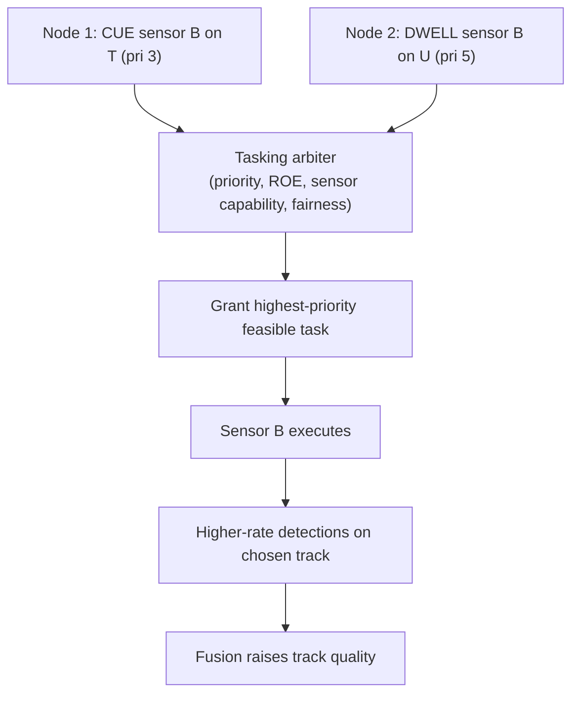
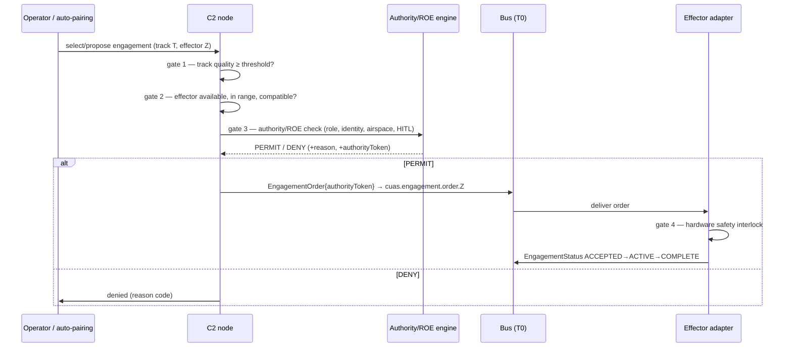

# 04 — Remote Sensor Tasking & Remote Fire Control

> Imperative 4: *Prioritize remote sensor tasking — control sensors and effectors
> across the network to improve track quality and enable remote fire control and
> distributed weapon pairing.*
>
> Imperative 5: *Any C2 node with permissions may launch an engagement with any
> effector on the network, using data from any sensor with sufficient track
> quality — replacing dedicated sensor-weapon pairings and the hub-and-spoke model.*

These two imperatives are one loop: tasking exists to raise track quality;
sufficient track quality unlocks engagement; engagement may itself cue more
tasking. This chapter defines that loop and its control points.

## 1. The decoupling that makes it work

Traditional short-range air defense wires a sensor to a shooter. This design breaks
the link into three independently-addressable roles on the bus:

```
   DETECT            DECIDE                 ENGAGE
   sensors    →   any C2 node w/ authority   →   any available effector
   (publish        (subscribes to fused COP,      (subscribes to its order
    tracks)         requests authority,            topic, enforces interlocks)
                    pairs track↔effector)
```

Because the three are decoupled, you get **distributed weapon pairing**: the
pairing is computed at decision time from *what's available and in range*, not
fixed at install time.

## 2. Remote sensor tasking

### 2.1 What can be tasked

| Task type | Meaning |
|---|---|
| `SEARCH` | Set/adjust a sensor's search volume or mode |
| `CUE` | Point a sensor at a track's predicted position (cross-cue from another sensor) |
| `SLEW` | Move a directional sensor (e.g., EO/IR) to a bearing/track |
| `DWELL` | Concentrate revisit/energy on a track to tighten its state |
| `HANDOFF` | Transfer custody of a track to another sensor/node |

Each is a `SensorTask` message (`specs/schemas/sensor-task.schema.json`) published
to `cuas.sensor.task.{sensorId}`.

### 2.2 Tasking arbitration

Multiple nodes may want the same sensor. An **arbiter** resolves contention so
tasking is deterministic and auditable.



Arbitration inputs: task priority, requester authority, sensor capability/coverage,
ROE state, and fairness (no node starves another). The decision is logged to the
audit stream.

### 2.3 The payoff: track quality on demand

This is why tasking is prioritized. A track at TQ 6 (detected, not engageable) can
be raised to TQ 10+ by cross-cuing a second sensor and commanding a dwell. The
engagement gate is on **fused track quality**, so tasking is the lever that turns a
marginal track into an engageable one — using whatever sensors the network has,
wherever they are.

## 3. Remote fire control

### 3.1 The engagement pipeline and its gates

Any authorized node may initiate; the request passes hard gates before an order
ever reaches an effector.



The four gates, in order, are: **track quality → effector feasibility → authority/
ROE → hardware interlock.** No single software bug bypasses all four; the last gate
is in the effector itself.

### 3.2 Distributed weapon pairing

Pairing is a function evaluated at decision time, not a wiring diagram. Reference
inputs the pairing logic scores:

- effector in range / engagement envelope for the track,
- effector readiness (ammo/charge/cooldown),
- predicted probability of kill vs. track classification,
- collateral / airspace deconfliction,
- preserving effectors for higher-priority threats (don't waste a hard-kill on a
  Group 1 if EW suffices).

The scaffold ships a deliberately simple pairing function so the *interface* is
demonstrable; the scoring model is exactly the kind of thing competed behind the
government-owned interface.

### 3.3 Why this beats hub-and-spoke

| Hub-and-spoke | Any-sensor / any-shooter |
|---|---|
| Sensor wired to one shooter | Any track → any effector at decision time |
| Node loss = coverage gap | Surviving nodes already see the fused COP and can engage |
| New effector = new integration | New effector subscribes to its order topic; done |
| Single points of failure | No central switchboard; bus + edge autonomy |
| Coverage = sum of fixed pairs | Coverage = union of all sensors × all effectors |

This is the concrete meaning of "ecosystem of survivability," "expanded coverage,"
and "continued operation even if some sensors or nodes are lost."

## 4. The control points the government must own

For each gate, the *policy* is government-owned even where the *implementation* is
competed:

1. **Track-quality threshold** — set by the government per effector class / ROE,
   not hard-coded by a vendor.
2. **Pairing constraints** — envelopes, deconfliction rules are government data.
3. **Authority/ROE encoding** — see [§05](05-security-authority-safety.md); this is
   never delegated to a vendor's discretion.
4. **Interlock interface** — the contract the effector's safety hardware must honor
   is government-owned even though the interlock hardware is the vendor's.

## 5. Failure & degraded modes (must be specified, not emergent)

- **Authority engine unreachable:** node falls back to a pre-delegated, cached
  authority envelope for its sector (fail-controlled, not fail-open). Out-of-
  envelope engagements are denied until reachback returns.
- **Bus partition:** edge node engages with locally-available effectors using the
  edge-fused COP; reconciles audit on reconnect.
- **Conflicting orders to one effector:** effector honors the first valid
  `authorityToken` and rejects duplicates by `trackId`/window; reports the
  conflict.
- **Stale track:** orders reference `timeObserved`; an effector rejects an order
  whose track is older than a configured tolerance.

Continue to [§05 — Security, Authority & Safety](05-security-authority-safety.md).
