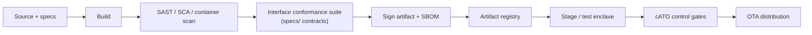

# 06 — Edge Topology, DevSecOps & Over-the-Air Updates

> Imperative 1 (in part): *web-based, cloud-enabled architecture, capable of
> over-the-air updates for all systems, sensors, and effectors.*

A common C2 is only "common" if it can be **deployed everywhere and updated
continuously** — from a cloud enclave down to a single rugged node at a remote site
that may be disconnected for days. This chapter covers the deployment topology and
the pipeline that keeps every node current.

## 1. Edge-to-echelon topology

```
                         ACCREDITED CLOUD / ECHELON ENCLAVE
   ┌───────────────────────────────────────────────────────────────────────┐
   │  broker cluster · theater fusion · BMC · web COP · registry · PDP ·     │
   │  OTA pipeline · audit archive            (continuous ATO, IL-appropriate)│
   └───────▲───────────────────▲───────────────────────────▲────────────────┘
           │ leaf link         │ leaf link                 │ leaf link
   ┌───────┴───────┐   ┌───────┴───────┐           ┌───────┴───────┐
   │  EDGE NODE A  │   │  EDGE NODE B  │   ...      │  EDGE NODE N  │
   │ leaf broker   │   │ leaf broker   │           │ leaf broker   │
   │ edge fusion   │   │ edge fusion   │           │ edge fusion   │
   │ edge C2 + UI  │   │ edge C2 + UI  │           │ edge C2 + UI  │
   │ sensors/effs  │   │ sensors/effs  │           │ sensors/effs  │
   └───────────────┘   └───────────────┘           └───────────────┘
     fully mission-capable when the leaf link is down
```

### Tiering principle

The **same container images, schemas, and APIs** run at the edge and at echelon.
The difference is scale and reach, not capability class. Echelon is a *superset*:
cross-site fusion, wide-area COP, the registry, the PDP master, and the OTA
pipeline. An edge node carries cached/delegated copies of what it needs (authority
envelope, ROE, schemas) to fight alone.

### DDIL behavior (Denied, Degraded, Intermittent, Limited)

- Leaf links are **store-and-forward**; the edge never blocks on the WAN.
- T0/T1 (fires/tasking) preempt T2–T4 across constrained links.
- On reconnect, edge and echelon **reconcile**: audit streams merge, fused tracks
  re-correlate, deferred updates apply.
- An edge node with no reachback runs on cached ROE/authority envelopes and local
  effectors — fail-controlled, never fail-open.

## 2. Cloud-native packaging

- **Containers, declarative deploy.** Every service ships as a hardened OCI image,
  deployed via Kubernetes (cloud) or a lightweight single-node runtime (edge,
  e.g., k3s/podman). The scaffold's `docker-compose.yml` is the local stand-in.
- **Platform alignment.** Target a DoD DevSecOps platform (e.g., Platform One /
  Big Bang) with **Iron Bank**-hardened base images so accreditation inheritance
  and continuous ATO are available rather than rebuilt per program.
- **Web-based UI.** The common C2 UI is a browser app served from the C2 node;
  no per-workstation install, so "intuitive for all occupational specialties"
  scales by pushing one updated UI, not reimaging laptops. A handheld/offline
  variant serves the disconnected edge.

## 3. Continuous ATO and the CI/CD pipeline



- Security scanning, SBOM generation, and **interface conformance** are pipeline
  gates: nothing ships that fails the government-owned contracts.
- **Continuous ATO (cATO)** replaces one-time accreditation: the pipeline's
  controls and monitoring are the authorization basis, so updates flow without a
  new paperwork cycle each time.

## 4. Over-the-air updates for C2, sensors, and effectors

OTA is required for all three classes, with increasing safety rigor.

| Target | What updates OTA | Guardrails |
|---|---|---|
| **C2 / UI / services** | Containers, UI, ROE/policy bundles, schemas | Signed, staged, health-checked, auto-rollback |
| **Sensors** | Adapter software, firmware, classifier models | Signed, A/B partition, verify-before-activate |
| **Effectors** | Adapter software; firmware *below* the safety interlock only via certified channel | Signed; safety-critical firmware follows weapons-safety release, never silent OTA |

### Update integrity (non-negotiable)

1. **Signed provenance.** Every artifact is signed in the pipeline; the target
   verifies the signature and SBOM before applying. No signature, no install.
2. **A/B + automatic rollback.** Updates land on an inactive partition; the node
   boots the new version, self-tests, and rolls back automatically on failure. A
   bad push must never brick a node in the field.
3. **Staged rollout.** Echelon → representative edge nodes → fleet, so a regression
   is caught on a few nodes, not all.
4. **Disconnected delivery.** OTA bundles are content-addressed and can arrive by
   intermittent link or physical media; the integrity check is identical either
   way.
5. **Safety carve-out.** Software that can change weapon behavior below the
   interlock is **never** pushed silently; it follows the certified
   weapons-software release process. OTA convenience stops at the safety boundary.

## 5. Observability

- Every node exports health/metrics to `cuas.*.status.*` and a metrics endpoint;
  the echelon COP shows node/sensor/effector readiness at a glance.
- The audit stream (`cuas.audit.*`) is the forensic record (see
  [§05](05-security-authority-safety.md#5-auditability-non-repudiation)).
- Update state (version, partition, last successful self-test) is itself a reported
  status, so the fleet's patch posture is visible from echelon.

Continue to [§07 — Roadmap](07-roadmap.md).
