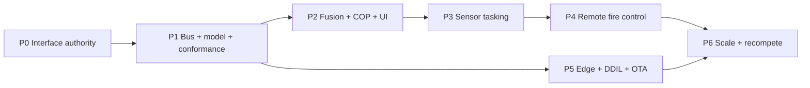

# 07 — Phased Roadmap

A build sequence that delivers value early and keeps the government-owned interface
as the spine throughout. Phases are capability gates, not calendar promises;
sequence and dependencies matter more than the month labels.

## Phase 0 — Stand up the interface authority (immediate, weeks)

**Goal:** make the government the owner before any more integration money is spent.

- Designate the **Interface Design Authority**, **Conformance Authority**, and
  **CCB** ([§02](02-api-governance.md#2-the-interface-owner-decide-this-first)).
- Ratify v1.0 of the canonical schemas + OpenAPI + AsyncAPI in this repo as the
  baseline ICDs; stand up the registry.
- Insert the anti-lock-in clauses and conformance requirement into every C-sUAS
  solicitation going forward
  ([§02 checklist](02-api-governance.md#8-anti-lock-in-checklist-put-in-every-solicitation)).

**Exit:** there is a named owner, a versioned interface, and a contract hook.
This phase is policy, not technology, and it is the highest-leverage step.

## Phase 1 — Bus + canonical model + conformance (this scaffold, hardened)

**Goal:** prove and field the connective tissue.

- Harden the pub/sub backbone for one tier (start at echelon/cloud) with QoS tiers
  and topic ACLs.
- Publish the conformance suite; stand up the reference implementation (this repo)
  as the test fixture.
- Onboard **two existing sensors and one effector** via government-owned adapters —
  the first proof that integration is now "pass the suite," not a bespoke project.

**Exit:** two vendors interoperate on the bus through the government interface, with
certificates. Integration cost curve visibly bends.

## Phase 2 — Fusion + COP + common web UI

**Goal:** one coherent threat picture and one C2 application.

- Field track fusion (correlation, state estimation, track-quality scoring, CID).
- Ship the web-based COP and role-tailored UI; begin replacing per-vendor operator
  screens.
- Integrate the identity/Zero Trust PDP for authentication and basic authorization.

**Exit:** operators see one fused COP from mixed-vendor sensors in one UI.

## Phase 3 — Remote sensor tasking + arbitration

**Goal:** raise track quality on demand across the network.

- Implement `SensorTask` end to end with the tasking arbiter.
- Demonstrate cross-cue: sensor A's track cues sensor B, fused TQ rises to
  engageable.

**Exit:** any authorized node can task any conformant sensor; TQ-on-demand works.

## Phase 4 — Remote fire control (any-sensor / any-shooter)

**Goal:** distributed weapon pairing under positive control.

- Implement the four engagement gates and the ABAC PDP with ROE-as-code
  ([§05](05-security-authority-safety.md)).
- Implement distributed weapon pairing and the effector interlock interface.
- Conduct a controlled live demonstration: a track from one sensor, an engagement
  by a non-paired effector, authorized by a remote node — the hub-and-spoke
  replacement, proven.

**Exit:** any-sensor/any-shooter demonstrated end to end with auditable authority
and hardware interlocks. (This is the capstone the imperatives describe.)

## Phase 5 — Edge push + DDIL hardening + OTA at scale

**Goal:** the same capability at a disconnected edge, kept current.

- Replicate the full stack to edge nodes (leaf brokers, edge fusion/C2, cached
  authority envelopes).
- Validate store-and-forward, fail-controlled degraded authority, and reconnect
  reconciliation.
- Operationalize OTA with A/B + rollback and staged rollout under cATO
  ([§06](06-edge-topology-devsecops-ota.md)).

**Exit:** an isolated edge node fights alone and updates over the air safely.

## Phase 6 — Scale, recompete, sustain

**Goal:** turn the win into a durable ecosystem.

- Broaden the conformant vendor pool; recompete components against the suite.
- Bridge to joint/coalition data links (Link 16, CoT federations) at gateways
  ([§08](08-standards-crosswalk.md)).
- Evolve interfaces through the CCB with strict backward-compatibility discipline.

**Exit:** adding or swapping a C-sUAS component is routine and competitive.

---

## Dependency map

## Risks and how the architecture mitigates them

| Risk | Mitigation in this design |
|---|---|
| "Open" interface quietly re-closes | Named IDA + CCB + conformance suite with negative tests |
| Vendors resist government data rights | Phase-0 contract clauses; conformance as entry ticket; competition pressure |
| Distributed fires erode positive control | PDP + ROE-as-code + hardware interlocks + WEAPONS_HOLD ([§05](05-security-authority-safety.md)) |
| Edge can't fight disconnected | Edge autonomy + cached authority envelopes + store-and-forward ([§06](06-edge-topology-devsecops-ota.md)) |
| OTA bricks a node | Signed A/B updates + auto-rollback + staged rollout |
| Hard-real-time fire loop outgrows general bus | DDS for the effector loop, bridged to NATS/MQTT; schemas transport-independent ([ADR-0001](decisions/0001-pubsub-backbone.md)) |

Continue to [§08 — Standards Crosswalk](08-standards-crosswalk.md).
